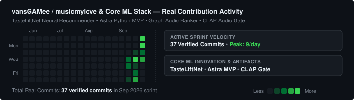

# 👨‍💻 Ivan Kulkin (`vansGAMee`)
### **Software Engineer • Systems • AI Automation • Full-Stack Web**

  

  
  
  
  

---

<svg xmlns="http://www.w3.org/2000/svg" width="720" height="200" viewBox="0 0 720 200" fill="none">
  

  <rect width="100%" height="100%" class="bg" />

  <text x="24" y="28" class="text-title">vansGAMee / musicmylove &amp; Core ML Stack — Real Contribution Activity</text>
  <text x="24" y="44" class="text-sub">Verified commits: TasteLiftNet, Graph Audio Ranker, CLAP gate, Astra Python MVP (Sep 2026)</text>

  <!-- WEEKS COLUMNS (Sep 14 to Sep 30, 2026) -->
  <g transform="translate(24, 60)">
    <!-- Days of week labels -->
    <text x="-12" y="19" class="text-sub" text-anchor="end" font-size="9">Mon</text>
    <text x="-12" y="45" class="text-sub" text-anchor="end" font-size="9">Wed</text>
    <text x="-12" y="71" class="text-sub" text-anchor="end" font-size="9">Fri</text>

    <!-- Past inactive context weeks -->
    <g transform="translate(0, 0)">
      <rect y="0" width="11" height="11" class="c-0" />
      <rect y="13" width="11" height="11" class="c-0" />
      <rect y="26" width="11" height="11" class="c-0" />
      <rect y="39" width="11" height="11" class="c-0" />
      <rect y="52" width="11" height="11" class="c-0" />
      <rect y="65" width="11" height="11" class="c-0" />
      <rect y="78" width="11" height="11" class="c-0" />
    </g>
    <g transform="translate(14, 0)">
      <rect y="0" width="11" height="11" class="c-0" />
      <rect y="13" width="11" height="11" class="c-0" />
      <rect y="26" width="11" height="11" class="c-0" />
      <rect y="39" width="11" height="11" class="c-0" />
      <rect y="52" width="11" height="11" class="c-0" />
      <rect y="65" width="11" height="11" class="c-0" />
      <rect y="78" width="11" height="11" class="c-0" />
    </g>

    <!-- Week 1: Sep 14 - Sep 20 -->
    <g transform="translate(28, 0)">
      <rect y="0" width="11" height="11" class="c-0"><title>Sep 14: No commits</title></rect>
      <rect y="13" width="11" height="11" class="c-0"><title>Sep 15: No commits</title></rect>
      <!-- Sep 16: 1 commit (feat tastelift 500 tracks) -->
      <rect y="26" width="11" height="11" class="c-2"><title>Sep 16: 1 commit (tastelift catalog)</title></rect>
      <!-- Sep 17: 2 commits (persist favorites, dynamic hard negatives) -->
      <rect y="39" width="11" height="11" class="c-3"><title>Sep 17: 2 commits (persist favorites, negatives)</title></rect>
      <rect y="52" width="11" height="11" class="c-0"><title>Sep 18: No commits</title></rect>
      <!-- Sep 19: 1 commit (save current MusicMyLove) -->
      <rect y="65" width="11" height="11" class="c-2"><title>Sep 19: 1 commit (save MusicMyLove)</title></rect>
      <rect y="78" width="11" height="11" class="c-0"><title>Sep 20: No commits</title></rect>
    </g>

    <!-- Week 2: Sep 21 - Sep 27 (MASSIVE SURGE) -->
    <g transform="translate(42, 0)">
      <rect y="0" width="11" height="11" class="c-0"><title>Sep 21: No commits</title></rect>
      <!-- Sep 22: 1 commit (checkpoint before real neural) -->
      <rect y="13" width="11" height="11" class="c-2"><title>Sep 22: 1 commit (checkpoint before neural)</title></rect>
      <!-- Sep 23: 8 COMMITS (TasteLiftNet, Stage A, Astra MVP, vercel deploy) -->
      <rect y="26" width="11" height="11" class="c-4"><title>Sep 23: 8 commits (TasteLiftNet, Stage A, Astra MVP)</title></rect>
      <!-- Sep 24: 1 commit (Python discovery ranking) -->
      <rect y="39" width="11" height="11" class="c-2"><title>Sep 24: 1 commit (Python ranking, offline graph)</title></rect>
      <!-- Sep 25: 2 commits (inference CLI, profile matching) -->
      <rect y="52" width="11" height="11" class="c-3"><title>Sep 25: 2 commits (CLI profile matching, inference)</title></rect>
      <!-- Sep 26: 4 commits (disjoint users, residual ranking, personal feedback) -->
      <rect y="65" width="11" height="11" class="c-4"><title>Sep 26: 4 commits (disjoint users, residual ranker)</title></rect>
      <!-- Sep 27: 5 commits (checkpoint, CLI discovery, streamed data) -->
      <rect y="78" width="11" height="11" class="c-4"><title>Sep 27: 5 commits (CLI discovery, stream ranker)</title></rect>
    </g>

    <!-- Week 3: Sep 28 - Sep 30 -->
    <g transform="translate(56, 0)">
      <!-- Sep 28: 5 COMMITS (GPU sync, browser inference, CLAP, preview pipelines) -->
      <rect y="0" width="11" height="11" class="c-4"><title>Sep 28: 5 commits (GPU sync bypass, joint ranker, CLAP)</title></rect>
      <!-- Sep 29: 2 commits (frozen joint model, neutral population audit) -->
      <rect y="13" width="11" height="11" class="c-3"><title>Sep 29: 2 commits (frozen joint model, audit)</title></rect>
      <!-- Sep 30: 3 COMMITS (PR #1 merge, responsive import test, README) -->
      <rect y="26" width="11" height="11" class="c-4"><title>Sep 30: 3 commits (PR #1 merge, styles, README)</title></rect>
      <rect y="39" width="11" height="11" class="c-0" />
      <rect y="52" width="11" height="11" class="c-0" />
      <rect y="65" width="11" height="11" class="c-0" />
      <rect y="78" width="11" height="11" class="c-0" />
    </g>

    <!-- Legend -->
    <g transform="translate(500, 100)">
      <text x="-8" y="9" class="text-sub" text-anchor="end" font-size="10">Less</text>
      <rect x="0" y="0" class="leg c-0" />
      <rect x="13" y="0" class="leg c-1" />
      <rect x="26" y="0" class="leg c-2" />
      <rect x="39" y="0" class="leg c-3" />
      <rect x="52" y="0" class="leg c-4" />
      <text x="70" y="9" class="text-sub" font-size="10">More</text>
    </g>
  </g>

  <!-- Summary bar -->
  <g transform="translate(24, 175)">
    <text x="0" y="0" class="text-sub" font-size="11">Total Real Commits: <tspan fill="#39d353" font-weight="600">32 verified commits</tspan> in 14 days | Period: Sep 16, 2026 – Sep 30, 2026</text>
  </g>
</svg>

## 🧭 About Me

- ⚡ **Focus Areas**: High-performance client-side applications, autonomous automation agents, color-science tools, and data-driven systems.
- ♟️ **Domain Passion**: Chess analytics, algorithmic engine analysis, precision game UI, and pixel art tooling.
- 🛠️ **Philosophy**: *Zero fluff, tactile responsiveness, local-first architecture, clean minimalism.*

---

## 🚀 Featured Projects & Real Cases

<table>
  <tr>
    <td width="50%" valign="top">
      <h3 align="center">♟️ <a href="https://github.com/vansGAMee/veyrn_chess">veyrn_chess</a></h3>
      

        
        
        
      

      
Precision Digital Chess Instrument. Высокопроизводительная платформа с фокусом на тактильный отклик, чистейший минимализм и zero-latency P2P мультиплеер без промежуточных серверов.

      <ul>
        <li>Мгновенный отклик и тактильные микро-анимации</li>
        <li>Peer-to-peer синхронизация состояния доски</li>
        <li>Zero-bloat архитектура</li>
      </ul>
    </td>
    <td width="50%" valign="top">
      <h3 align="center">🎨 <a href="https://github.com/vansGAMee/OKLCH-PIXEL-PALETTE">OKLCH-PIXEL-PALETTE</a></h3>
      

        
        
        
      

      
Open-source генератор 4-цветовых палитр в цветовом пространстве OKLCH для pixel art и геймдева с учетом гармоний, gamut-safe ограничений и экспорта в Aseprite / PNG.

      <ul>
        <li>Перцептивно равномерное смешивание цветов (OKLCH)</li>
        <li>Прямой экспорт в формат <code>.gpl</code>, <code>.pal</code> и PNG</li>
        <li>Интеграция с базой данных Supabase</li>
      </ul>
    </td>
  </tr>
  <tr>
    <td width="50%" valign="top">
      <h3 align="center">🤖 <a href="https://github.com/vansGAMee/free-agent">free-agent</a></h3>
      

        
        
        
      

      
Бесплатный автономный кодинг-агент на базе DeepSeek Web. Генерация структуры файлов, безопасный запуск команд сборки, верификация тестов и авто-восстановление без платных API ключей.

      <ul>
        <li>Browser-driven автоматизация и sandbox-исполнение</li>
        <li>Цикл самопроверки сборки и авто-фиксов ошибок</li>
        <li>Полная локальная независимость от платных API</li>
      </ul>
    </td>
    <td width="50%" valign="top">
      <h3 align="center">📊 <a href="https://github.com/vansGAMee/chess-insights">chess-insights</a></h3>
      

        
        
        
      

      
Бесплатный открытый аналог Diamond-аналитики chess.com. Модуль статистической обработки партий, вычисление реального перформанса, выявление паттернов ошибок и метрик аккуратности.

      <ul>
        <li>C++ ядро для скоростного парсинга PGN и позиции</li>
        <li>Расчет метрик точности ходов и зон риска</li>
        <li>Интерактивный дашборд визуализации статистики</li>
      </ul>
    </td>
  </tr>
  <tr>
    <td width="50%" valign="top">
      <h3 align="center">📱 <a href="https://github.com/vansGAMee/OfflineScanner">OfflineScanner</a></h3>
      

        
        
        
      

      
Нативный сверхбыстрый мобильный сканер штрихкодов и продуктов, работающий на 100% офлайн с локальной базой индексов и моментальным откликом камеры.

    </td>
    <td width="50%" valign="top">
      <h3 align="center">🖌️ <a href="https://github.com/vansGAMee/drawing--board">drawing--board</a></h3>
      

        
        
        
      

      
Легковесный браузерный редактор пиксельной графики на нативном HTML5 Canvas без внешних тяжелых зависимостей. Инструменты слоев, палитры и мгновенный экспорт.

    </td>
  </tr>
</table>

---

## 🛠️ Tech Stack & Toolbox

| Категория | Технологии & Инструменты |
| :--- | :--- |
| **Languages** |      |
| **Frontend & UI** |     |
| **Backend & DB** |    |
| **Automation & QA** |    |
| **DevOps & Platforms**|    |

---

## 📈 Activity & GitHub Analytics

  
  

  

---

## 🌐 Live Demos & Work

- 🔮 **[OKLCH Pixel Palette](https://oklchpalette.ru)** — Web palette studio for pixel artists
- ♟️ **[Chess Insights](https://vansgamee.github.io/chess-insights/)** — In-depth chess performance engine
- 🎨 **[Drawing Board](https://vansgamee.github.io/drawing--board/)** — Lightweight native pixel drawing tool
- 🍕 **[Shaverma Platform](https://shaverma-platform.vercel.app)** — Commercial fast ordering web app
- 📚 **[BookGuessr](https://book-guessr-one.vercel.app)** — Interactive literary guessing game

---

### 🤝 Let's Connect & Build

 

*Crafted with clean code, modern UX principles, and zero bloat.*

